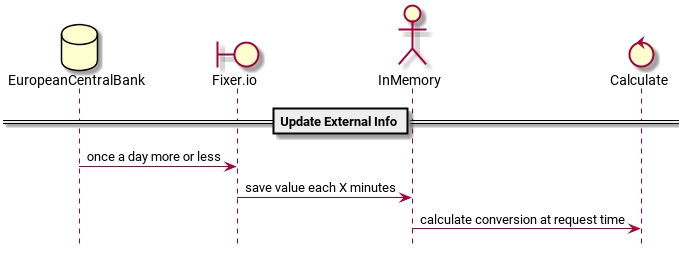

# Currency Conversion
Get currency conversion from fixer.io site inside a multithreaded app.

<!--
@startuml{summary.png}

hide footbox

database EuropeanCentralBank 
boundary Fixer.io 
actor InMemory 
control Calculate 

== Update External Info ==
EuropeanCentralBank -> Fixer.io : once a day more or less
Fixer.io -> InMemory : save value each X minutes 
InMemory -> Calculate : calculate conversion at request time

@enduml
-->

### Sites to browse

[Euro foreing exchange refernce rates](http://www.ecb.europa.eu/stats/policy_and_exchange_rates/euro_reference_exchange_rates/html/index.en.html)

[Read from curl into a string](http://stackoverflow.com/questions/2329571/c-libcurl-get-output-into-a-string)

[JSON API for foreign exchange rates and currency conversion](http://wwww.fixer.io)

[A multi-threaded example that uses pthreads to fetch several files at once](https://curl.haxx.se/libcurl/c/multithread.html)

## One ring to rule them all

One-liner to generate binaries, documentation, run tests, install and package:

#### Usually slower and aimed at humans 

Update manually that number of cores on the machine (make -j6):

      rm -rf build && mkdir -p build && cd build && cmake .. -DCurrency_TEST=1 -DCXXFLAGS_RELEASE_FLAG=1 -DCurrency_PLANTUML=1 && make -j6 && ctest && make install && make installDocCurrency && cpack

#### Usually faster and aimed at machines

No need for updating the number of cores:

      rm -rf build && mkdir -p build && cd build && cmake .. -G "Ninja" -DCurrency_TEST=1 -DCXXFLAGS_RELEASE_FLAG=1 -DCurrency_PLANTUML=1 && ninja && ctest && ninja install && ninja installDocCurrency && cpack

### Access to internal VERSION information.

Similar to the previous section, just use **strings** command for summary and detail version info:

      strings ./Currency_test | grep Currency_VERSION: | sort -u 
      strings ./Currency_test | grep Currency_VERSION_INFO: | sort -u 

Being that information embedded on the libraries themselves, it's possible to directly query to them:

      strings ./libCurrency.a | grep Currency_VERSION: | sort -u 
      strings ./libCurrency.a | grep Currency_VERSION_INFO: | sort -u 

On *macOS* as well:

      strings ./libCurrency.a | grep Currency_VERSION: | sort -u 
      strings ./libCurrency.a | grep Currency_VERSION_INFO: | sort -u 

### Running unit test with CTEST ###

In order to get output on case of faiure, don't forget to set **CTEST_OUTPUT_ON_FAILURE=1** before invoking those tests.

### Extra logging for unit tests

Invoke directly the testing executable with the proper level flag:

       test/Currency_test  --log_level=message

### Install libraries and tests ###

Environment variable INSTALL_PREFIX can be defined to target your favourite installation folder. 

### Building with 'Ninja' instead of 'Unix Makefiles' ###

Chose 'Ninja' building genarator instead of default 'Unix Makefiles' when **cmake** is invoke if you like it best:

      cmake .. -G 'Ninja'

After that, just execute the usual 'make-like' targets:

      ninja
      ninja test
      ninja docCurrency
      [sudo] ninja install

### Build test cases

Activate test flag when **cmake** command is invoked. For example:

       cmake .. -G "Ninja" -DCurrency_TEST=1

### Package generation

Just use the command **cpack** once the binaries and documentation to be packed have been generated. For example:

     ninja && ninja docCurrency && cpack

Or if classic Unix Makefiles are used:

     make && make docCurrency && cpack

By default, a **tar.gz** file will be created. See [CPack](https://cmake.org/Wiki/CMake:Packaging_With_CPack) for further details on **deb** or **rpm** packages.

### PlantUml diagrams 

[PlantUML](http://plantuml.com) is a component that allows to quickly write *UML* and non-UML diagrams. It's based on **graphviz/dot** utilities and implement a wrapper in *java*:

    java -jar /opt/plantuml/plantuml.jar -o images/  README.md

Taking advantage from the fact that **PlantUML** stores diagram metainfo embedded inside of those images so they might be updated **ONLY** when they really got changes. That way *git repository space* will be spared and previous *java* command added to **.cmake** scripts. But take into account that everytime that *plantuml.jar* is updated may imply to refresh all the diagrams becuase that metainfo could depends on the version of the library:

    cmake .. -DCurrency_PLANTUML=1

### Convert GitHub Markdown into MediaWiki

[Pandoc](http://pandoc.org) library tools lets you convert a lot of different formats:

    pandoc --from=markdown_github --to=mediawiki --output=README.wiki README.md

